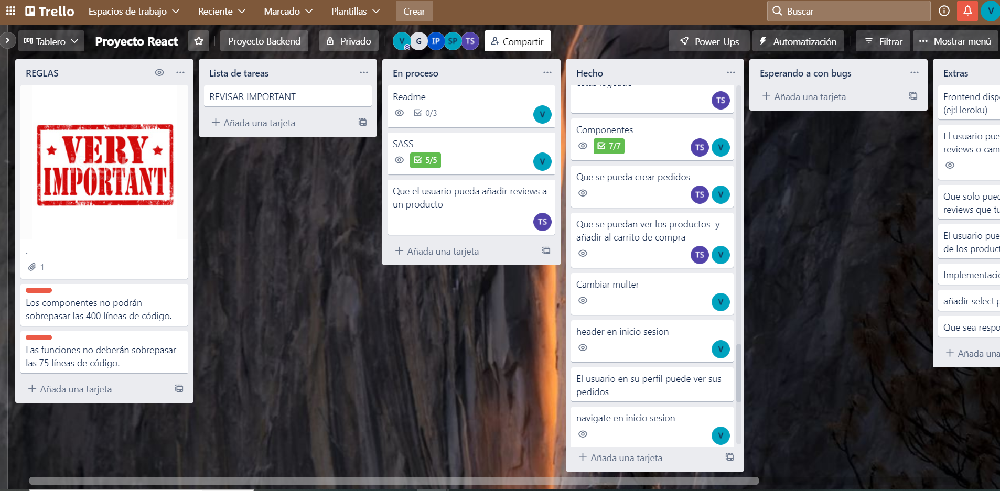
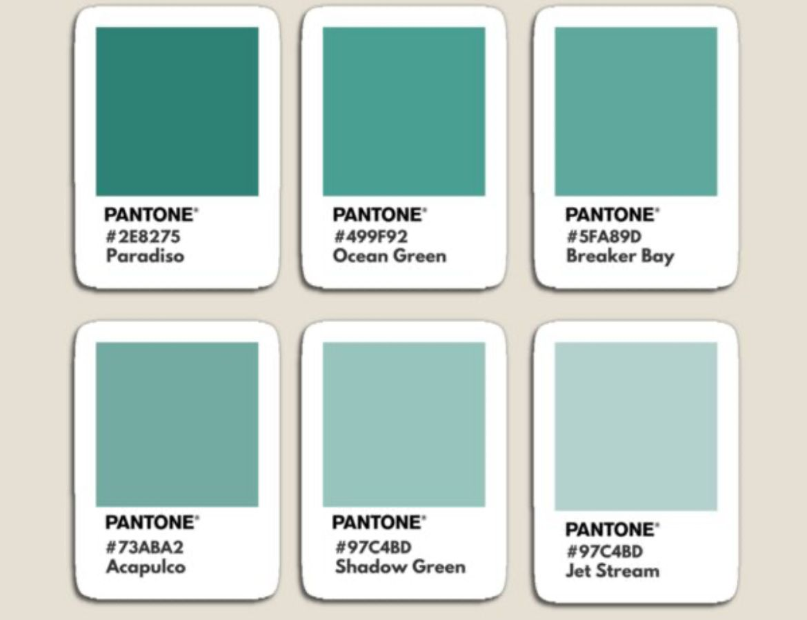
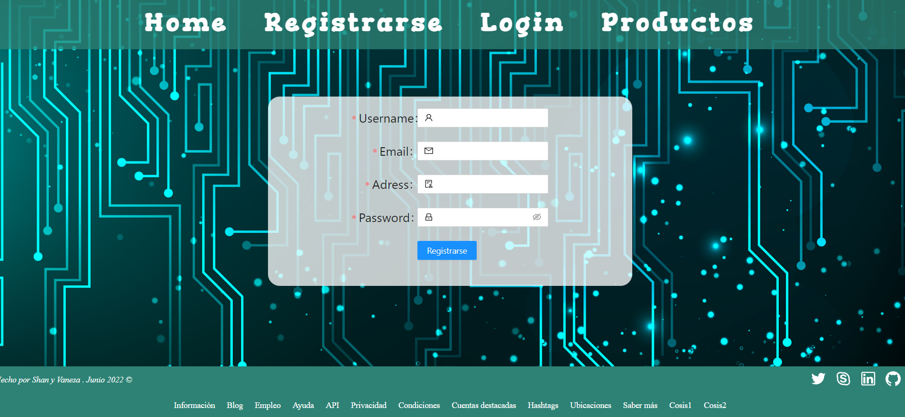
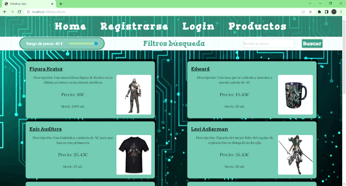
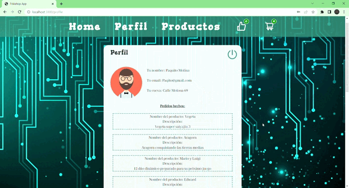
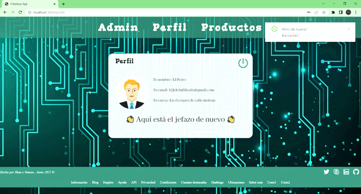
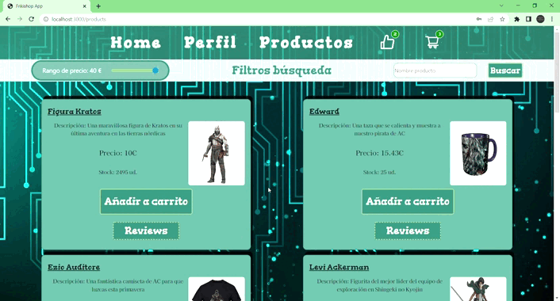
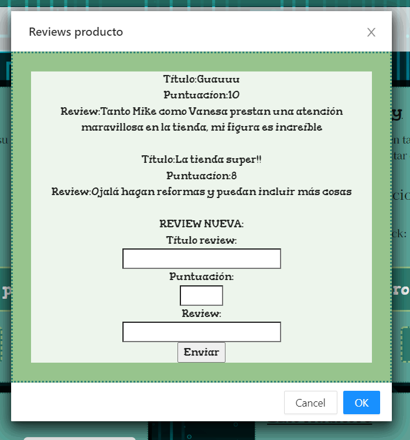

#  <center> :video_game: :space_invader: Proyecto Frontend: Frikishop :video_game: :space_invader: </center> 

 ## :clipboard: Índice :clipboard:

 - [Sobre el proyecto](#bookmarktabs-sobre-el-proyecto-bookmarktabs)

    - [Instalación y despliegue](#nutandbolt-instalación-y-despliegue)

    - [Tecnologías utilizadas](#wrench-tecnologiaspackages-utilizados)

    - [Origen](#dart-origen)

    - [Objetivos](#pushpin-objetivos)

    - [Inspiración](#cinema-inspiración)

- [Descripción del proyecto](#greenbook-descripción-del-proyecto-greenbook)

    - [API](#1-api)

    - [Componentes](#2-componentes)


    - [Context](#2-componentes)


    - [React router](#4-react-router)


- [Retos presentados](#dart-retos-presentados-dart)

    - [Vista Admin](#vista-admin)

    - [CRUD de productos](#crud-de-productos)

    - [Borrar producto concreto](#borrar-producto-concreto)

    - [Implementar Multer](#implementar-multer)
  
    -[Diseños modales antDesign](#diseños-modales-antdesign)


- [Agradecimientos](#agradecimientos)

- [Futuras implementaciones](#blacknib-futuras-implementaciones-blacknib)

- [Autores](#raisedhands-autores-raisedhands)

------------------

# :bookmark_tabs: Sobre el proyecto :bookmark_tabs:


## :nut_and_bolt: Instalación y despliegue 
Para el desarrollo de este proyecto se ha utilizado React principalmente.
El proyecto se subirá a un repositorio público de GitHub.
Además, el backend procede de la API anteriormente creada para e-commerce online: [Frikishop API](https://github.com/vaneebg/BACKEND_FRIKISHOP).
Para instalar este proyecto debes hacer lo siguiente: primero acceder desde github a los dos repositorios y proceder a clonártelos con el siguiente comando:
````
git clone https://github.com/vaneebg/PROJECT-FRONTEND-FRIKISHOP
git clone https://github.com/vaneebg/BACKEND_FRIKISHOP
````
Una vez clonado el repositorio es muy importante que en tu consola instales todos los npm que necesita cada proyecto con el siguiente comando: 
````
npm i
````


Por último, procede a levantar el servidor primero en el proyecto de backend con este comando:
```
npm start
```
Y después en el proyecto de frontend, entras con cd my-frikishop/ y una vez dentro de la carpeta, levantas el servidor:
```
npm start
```

Automáticamente se te abrirá una nueva ventana del navegador con la página web.

---------
## :wrench: Tecnologias/packages utilizados 
- Javascript
- React
- SASS
- Context
- UseReducer
- React Router
- Axios
- NodeJS
- MySQL
- Sequelize
- Bcrypt
- Jsonwebtoken
- Multer
- AntDesign
- Trello

---------

## :dart: Origen 
Es un proyecto fullstack de la academia The Brigde para asentar conocimientos sobre la utilización de React conjuntamente con context y useReducer, esta vez adaptado para trabajar con la API de backend que hemos creado anteriormente para un e-commerce, con lo cual se trabajan aptitudes anteriores, como el uso de Axios para llamar a nuestra API y el trabajo con NodeJS en caso de tener que modificar algo en la API para mejorar el funcionamiento. En lo referente al diseño, se ha seguido utilizando SASS y la librería AntDesign, que nos ha proporcionado tanto nofificaciones, como formularios e iconos entre otros.


Se ha trabajado en diversas ramas de Git para continuar con el proceso de aprendizaje de esta herramienta y fomentar las buenas prácticas. Primeramente se ha creado la rama develop y, como ha sido un trabajo en parejas, cada uno de nosotros dividía develop en varias subramas para trabajar desde ahí. Después cada uno mergeaba develop primero en su subrama, y una vez comprobado que todo seguía en funcionamiento, se mergeaba a develop y se subía a github para que el otro compañero pudiese hacer un pull para bajarse las nuevas implementaciones. Finalmente, una vez asegurado que todo e proyecto está en funcionamiento desde develop, se mergea a main.


Para la comunicación en equipo hemos hecho uso principalmente de Trello, dividiendo cada tarjeta por tareas:


------
 
## :pushpin: Objetivos 

**GENERALES:**

- [X] Registro de usuarios.
- [X] Login de usuarios.
- [X] Que se puedan ver los productos  y añadir al carrito de compra
- [X] Que se pueda crear pedidos
- [X] Que en tu perfil puedas ver tus datos
- [X] Uso de ramas con git, cuando se termine el proyecto deberán quedar dos ramas la master o main y la develop.
- [X] Presentación de README excelente.


## 1.1. E-commerce( tienda online)

- Componentes mínimos:
    - [X] Register
    - [X] Login
    - [X] Home
    - [X] Products
            - Product
    - [X] Perfil. Vista perfil con los datos del usuario logeado y sus pedidos
    - [X] Header
    - [X] Footer
- [X] Implementa React Router en tu página
    - /home. Home de la app
    - /login
    - /register
    - /profile. 
- [X] Utilizar Context 
- [X] Readme Excelente
- [X] Uso de SASS
- [X] Importante el diseño

*Reglas:*
- [X] Los componentes no podrán sobrepasar las 400 líneas de código.
- [X] Las funciones no deberán sobrepasar las 75 líneas de código.


## 1.2. Extras
- [ ] Frontend disponible en producción (ej:Heroku)
- [X] Buscador de productos
- [X] Implementación de filtros, por ejemplo que se pueda filtrar un producto por precio
- [X] El usuario con rol Admin pueda tiene una opción en el nav que le lleva a la vista Admin
- [X] Vista Admin donde se puede hacer el CRUD de productos (solamente si tienes el role Admin)
- [X] CRUD de los productos
- [X] Añadir o quitar un producto de favoritos
- [X] Que el usuario pueda añadir reviews a un producto
- [ ] Que solo puedas editar y eliminar las reviews que tu creas.
- [ ] El usuario puede subir fotos en las reviews o cambiar su foto de perfil.
- [ ] El usuario puede dar likes a las reviews de los productos.
- [X] El usuario en su perfil puede ver sus pedidos
- [ ] Implementación de guards
- [/] Que sea responsive


-------------------
## :cinema: Inspiración 
La idea principal con la que se ha construido este proyecto es un diseño de cómic tal como ele componente Home indica. Al final hemos visto adecuado que, ya que setrata de una tienda friki, su diseño se adapte a estas características. Para ello, se ha utilizado principalmente una paleta de diversos verdes "geek" y también transparencias para la barra de navegación del header por ejemplo En el archivo colors.scss, están guardadas tanto la paleta de colores, como las dos fuentes principales que se han usado en la web en forma de variables:


Para el fondo general de la página, se ha escogido una imagen del mismo estilo con un attachment "fixed" para no tener los cortes de imagen y así ponerla estable en todo el fondo:


En Home hay una animación general de bienvenida que emula a las películas de Marvel:


En cuanto al diseño en general, tiene un diseño basado en tarjetas que están levemente pintadas con transparencia, por ejemplo el componente Register:




El el caso del componente Products presenta el mismo diseño, solo que son tarjetas coloreadas con efecto sombra y los filtros de búsqueda es una barra sticky que conforme bajemos se quedará fija con un leve efecto de transparencia:



Una vez el usuario ha hecho Login, aquí podemos ver la vista de perfil y la sección productos contiene los 3 botones de ver reviews, añadir un producto al carrito o a favoritos:



En lo referente a la vista Admin, en perfil, la sección de pedidos hechos se elimina y encontramos que en el header se visualiza un componente nuevo, y en productos aparecen los botones eeditar y eliminar producto: 




Para finalizar, siguiendo con la temática friki, se han añadido gifs en caso de que vacíes tu cesta o tus favoritos, para indicar al usuario que efectivamente ha borrado eso bien:





Prácticamente toda la página web tiene diseñadas unas notificaciones que avisan al usuario de que ha hecho Login bien o se ha registrado correctamente:


----------
# :green_book: Descripción del proyecto :green_book:

## 1. API
La API a la que realizamos las llamadas es la que construimos en un proyecto anterior con base en MySQL usando Sequelize. Toda la información acerca de la API la puedes encontrar aquí:
````
https://github.com/vaneebg/BACKEND_FRIKISHOP
````
En el Readme se explican todos los endpoints y el funcionamiento en general de la misma.
----------

## 2. Componentes
Son un total de 11 componentes y 2 subcomponentes de Productos, cada uno de ellos enlazado a su fichero scss:


Dos de ellos se encuentran fijados para aparecer siempre independientemente del componente al que te hayas dirigido:
- **Header:** Links iniciales hacia Login, Registrarse, Home y Productos. Una vez se ha hecho Login, los links son: Home, Perfil, Productos, y dos iconos que son los componentes de Carrito y Favoritos, con un número dinámico que va cambiando según se rellenen ambos componentes.
    Al iniciar sesión como Admin, solo se muestra el componente Admin, Perfil y Productos.


- **Footer:** consta del nombre de los autores junto con el año de creación. A mano derecha hay una serie de links dispuestos como iconos que redireccionan a las diferentes redes sociales (solo en funcionamiento real github y linkedin).
Finalmente hay una serie de links no funcionales para simular el pie de página de varias webs.


Resto de componentes:


- **Home:** cuenta únicamente con un texto y todo lo demás es animación en SCSS con el cambio de transiciones entra background-image y varios transform.

- **Admin:** consta de tres Link: el primero 'Crear producto' te lleva al subcomponente 'AddProduct', que consta de un formulario para rellenar con la información del nuevo producto: nombre, descripción, stock y precio. El segundo link y el tercero (modificar y borrar producto) te lleva al componente Products pero con el añadido de dos botones: Editar y Borrar. Si le damos a Editar, nos lleva al segundo subcomponente de Products, **'EditProduct'**, que consta del mismo formulario que **'AddProduct'** pero esta vez para modificar el producto sobre el que hayamos hecho click. Finalmente, el botón borrar, elimina el producto de la base de datos y también del propio frontend inmediatamente mediante un filter previo.

- **Cart:** este componente realiza varias funciones. La primera, llamar a las funciones de carrito y crear order previamente cogidas de ProductContext y OrderContext. Y por otra parte se encarga de ir pintando en el componente los productos que se van añadiendo en el carrito junto con un total de precio de la suma de todos los productos que haya. Además, este componente se guarda en localStorage bajo la key 'cart' de forma que el usuario aunque actualice la página, tenga su carrito previamente guardado.

- **Favs:** las mismas funcionalidades que el componente Cart pero para añadir productos favoritos. Sin embargo, pese a que el mismo producto se puede poner en la cesta varias veces (podemos querer varias uds), en favoritos no sucede así. Una vez le das a un producto, este botón desaparece para que no lo puedas guardar dos veces. Tanto este componente como Cart, poseen la opción de borrar un solo producto de la lista independientemente del resto.

- **Products:** este componente coge previamente todas las funciones necesarias desde ProductsContext para pintar los productos o filtrarlos. Además utiliza localStorage para el token y el role. El token es necesario para que el usuario logeado pueda realizar acciones, como el botón de añadir carrito o de favoritos. El role por otra parte, actúa como filter, de forma que si el usuario que hizo login es el Admin, los botones de carrito y favoritos desaparecen, y trae los botones de Editar o Eliminar un producto. Este mismo componente, además de pintar los productos, tiene en la cabecera una barra sticky semitransparente que actúa como filtros de búsqueda. A mano izq hay un filtro por precio y a mano derecha un buscador por nombre.

- **Profile:** está compuesto por la información del usuario junto con su foto de perfil y abajo una enumeración de los productos que se han pedido en cada Order, o bien si es el Admin, simplemente se sustituye por un mensaje de bienvenida. En la esquina superior derecha encontramos el botón de Logout para que el usuario salga de la plataforma.

- **Login:** compuesto principalmente por un formulario que pide el email y la contraseña del usuario previamente registrado. Cuenta con una verificación de seguridad traída desde el backend, con lo cual si el usuario introducido no coincide con el guardado en la BBDD, salta un alert:


- **Register:** consta principalmente de un formulario en el que el usuario tiene que introducir cuatro campos: username, email, adress y password. Tanto en Login como en el resto de formularios hay validaciones de forma que el usuario no se puede dejar ningún campo en blanco.

- **Reviews:** tiene dos partes diferenciadas. La primera parte corresponde a pintar en el modal de reviews las que ya tienen los productos. En su segunda parte, por medio de un formulario con inputs, se encarga de enviar una nueva review hecha por el usuario.Este componente se muestra en el modal que aparece al darle al botón de reviews:



-------

## 3. Context
La parte fundamental sobre la que se sustenta el trabajo. Tiene como objetivo globalizar la información (en este caso la que obtenemos de la API) para poderla utilizar luego en cualquier de nuestros componentes.
En este caso, dentro de la carpeta context, tenemos 4 diferentes:

- **OrderContext:** tiene el fichero OrderState, que se encarga de realizar la llamada a la API para crear una nueva order.Para ello coge el id de los productos que están en el carrito, y además el token para comprobar que efectivamente, la autenticación es válida para realizar esta acción. Después en OrderContext.Provider globalizamos esa información.

- **ProductsContext:** en ProductsState tenemos las diferentes funciones que usamos. Para realizarlas, necesitamos de LocalStorage el token, el carrito y los favs. Aquí además de las funciones que competen a los productos, como llamar a la API para conseguirlos todos, o hacer filtro por nombre, también están las funciones del carrito y los favs, como borrar un solo elemento o borrarlos todos. Estas funciones luego las llamamos en los componentes Cart y Favs para poderlas utilizar gracias a ProductsCOntext.Provider. En ProductReducer tenemos los diferentes casos en los que el dispatch se va a centrar. Especial mención a los casos de borrar un producto y borrar un favorito o un elmento del carrito. Llevan un filter para que automáticamente después de realizar la acción, el usuario ya no vea ese elemento en su lista.

````
const initialState = {
    token: token ? token : null,
    products: [],
    cart: cart ? cart : [],
    favs: favs ? favs : [],
    product:{}
};
````

````
  case "DELETE_PRODUCT":
            return {
                    ...state,
                    products: state.products.filter((el) => +action.payload.el !== +el.id )
                };
````

- **UserContext:** en UserState encontramos las diferentes funciones que llaman a la API. En este caso necesitamos de localStorage el token y el role que se guardarán cuando el usuario haga Login y se borrarán cuando haga su Logout. En esta función de login es dónde hemos implementado la verificación para que si la respuesta de la API es email o contraseña incorrectos, esa respuesta sea la mismaen el frontend en forma de alert. Con ello evitamos que introduciendo cualquier cosa en el formulario de login, el usuario entre. en UserReducer tenemos todos los casos en los que va a ir pasando el dispatch cuando realicemos las diferentes acciones.
````
const initialState = {
    token: token ? token : null,
    role:role ? role : null,
    user: null,
    message:''
}
````

- **ReviewsContext:** en ReviewsState tenemos las diferentes funciones encargadas de este componente, crear reviews y conseguirlas. En ReviewsReducer los diferentes casos de dispatch.
````
const initialState={
    token: token ? token : null,
    reviews:[],
    review:{},
    id:[]
}
````


-----------

## 4. React router
Para la utilización de rutas en forma de Link en el proyecto, se instala este componente y se importa en nuestra App.jsx:
``````
import { BrowserRouter, Route, Routes } from "react-router-dom";
``````
Después, debemos poner todos los componentes entre los que queramos navegar dentro de estas etiquetas 'BrowserRouter' y los path a las rutas dentro de Routes. Gracias a esto, ahora podemos navegar entre los componentes, un ejemplo de ello es la barra de navegación del componente Header:
`````
        <span>
            <Link to="/home">Home</Link>
          </span>
        <span>
          <Link to="/register">Registrarse</Link>
        </span>
        <span>
          <Link to="/">Login</Link>
        </span>
        <span>
            <Link to='/products'>Productos</Link>
          </span>
`````

Después en App.jsx, debemos englobar todo dentro de los providers anteriormente creados para poder usar la información globalmente:
```` 
<UserProvider>
    <ProductsProvider>
         <OrdersProvider>
              <ReviewsProvider>
              [...]
````


  --------------------
# :dart: Retos presentados :dart:

## - Vista Admin:

Puesto que los token van cambiando conforme haces login o logout, no servía para hacer el filtro. Esto se solucionó guardando el role con el que entraba cada usuario a la tienda, ya que ed forma predefinida cualquier usuario nuevo adquiere el role de 'user', mientras que el Admin posee un role de 'SuperAdmin'. Una vez sacado el role de localStorage, simplemente había que hacer un condicional en el que si ese role coincidía, se vería la vista Admin. Lo mismo con el usuario registrado, si el token existe, se muestran diferentes vistas, como poder añadir al carrito o a favoritos. Igualmente en vista Admin, en los productos no salen estas dos opciones anteriores, sino que sale borrar producto o editarlo. 

## - CRUD de productos:

 Puesto que se hace la llamada a una API creada por nosotros, ha habido veces que era necesario cambiar send.res en nuestra API para traernos a frontend lo que nos interesaba. Especial cuidado con las rutas  y las autenticaciones de la API para ponerlas en la llamada con axios correctamente.

## - Borrar producto/fav/carrito concreto:

Vaciar del carrito únicamente un producto supuso un reto. Había que traerlo desde LocalStorage y borrar ese concreto, además de filtrar para que ese producto coincidente con la misma id no apareciese en pantalla después de ser eliminado.


## - Implementar multer

Cambiar la implementación de Multer en el backend por una más sofisticada, que guardase en diferentes carpetas según si la imagen era del usuario, del producto o de las reviews, además de cambiar que la imagen sea un campo obligatorio en la entrada de la creación de un producto o de un usuario por ejemplo.


## Diseños modales antDesign

Los modales vienen con estilos en linea predispuestos y resulta dificil cambiar textos dentro del modal, así como el tipo de letra o cualquier otro estilo.


## Crear review por producto

Traer el ID del producto que elegimos del componente de productos al de reviews atraves del contexto de reviews!

------------------------------


# :purple_heart: Agradecimientos :purple_heart:
A una gran amiga por la idea del diseño principal, a [Fran](https://github.com/franpd8) por las peleas con el background de los modales de AntDesign.

A la profe [Sofia](https://github.com/SofiaPinilla) por la ayuda...!


----------------


# :black_nib: Futuras implementaciones :black_nib:
- [ ] Responsive
- [ ] Creación de componentes hijos que dividan las funciones del componente padre.
- [ ] Implementación de guards
- [ ] Implementación del resto de funcionalidades de las reviews.
- [ ] Subir foto con productos.
- [ ] Modificar review por el mismo input de text.

----------------------


# :raised_hands: Autores :raised_hands:
- :smiling_imp: [Vanesa Beltrán](https://github.com/vaneebg)
- :whale2: [Shan](https://github.com/tianfanshan) 
